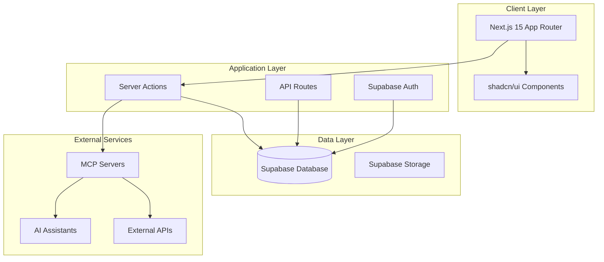

# Design Document

## Overview

InventoryFlow is a modern, full-stack inventory management system built specifically for jewelry businesses. The system leverages Next.js 15 with App Router for optimal performance, Supabase for backend services, and integrates MCP servers for AI-powered insights and external data connectivity.

### Key Design Principles
- **Type Safety**: Full TypeScript implementation across frontend and backend
- **Performance**: Server-side rendering with Next.js 15 App Router
- **Scalability**: Modular architecture with clear separation of concerns
- **User Experience**: Responsive design with shadcn/ui components
- **Data Integrity**: Comprehensive validation and audit trails
- **Currency Flexibility**: Multi-currency support with real-time conversion

## Architecture

### High-Level Architecture



### Folder Structure

```
inventory-flow/
├── app/                          # Next.js 15 App Router
│   ├── (auth)/                   # Auth route group
│   │   ├── login/
│   │   └── register/
│   ├── (dashboard)/              # Protected dashboard routes
│   │   ├── inventory/
│   │   ├── customers/
│   │   ├── suppliers/
│   │   ├── sales/
│   │   └── analytics/
│   ├── api/                      # API routes
│   │   ├── inventory/
│   │   ├── customers/
│   │   ├── suppliers/
│   │   └── mcp/
│   ├── globals.css
│   ├── layout.tsx
│   └── page.tsx
├── components/
│   ├── ui/                       # shadcn/ui components
│   ├── forms/                    # Form components
│   ├── tables/                   # Data table components
│   └── charts/                   # Analytics components
├── lib/
│   ├── supabase/                 # Supabase client and utilities
│   ├── validations/              # Zod schemas
│   ├── utils.ts                  # Utility functions
│   └── constants.ts              # Application constants
├── server/
│   ├── actions/                  # Server actions
│   │   ├── inventory.ts
│   │   ├── customers.ts
│   │   ├── suppliers.ts
│   │   └── sales.ts
│   └── queries/                  # Database queries
├── mcp/
│   ├── servers/                  # MCP server configurations
│   ├── tools/                    # MCP tool definitions
│   └── integrations/             # External API integrations
├── supabase/
│   ├── migrations/               # SQL migrations
│   └── types/                    # Generated TypeScript types
└── types/
    └── database.ts               # Custom type definitions
```

## Components and Interfaces

### Core Data Models

#### Product Model
```typescript
interface Product {
  id: string
  title: string
  sku: string
  color: string
  inr_cost_price: number
  inr_exchange_rate: number
  gbp_purchase_price: number
  gbp_sale_price: number
  profit: number // Calculated field
  sold: boolean
  sold_date: Date | null
  barcode: string
  supplier_id: string
  created_at: Date
  updated_at: Date
}
```

#### Customer Model
```typescript
interface Customer {
  id: string
  name: string
  email: string
  phone: string
  address: string
  total_purchases: number // Calculated field
  created_at: Date
  updated_at: Date
}
```

#### Supplier Model
```typescript
interface Supplier {
  id: string
  name: string
  contact_person: string
  email: string
  phone: string
  address: string
  payment_terms: string
  created_at: Date
  updated_at: Date
}
```

#### Sale Model
```typescript
interface Sale {
  id: string
  customer_id: string
  product_id: string
  sale_price: number
  currency: 'INR' | 'GBP'
  payment_method: string
  sale_date: Date
  notes: string
  created_at: Date
}
```

### Database Schema

#### Supabase Tables

```sql
-- Products table
CREATE TABLE products (
  id UUID PRIMARY KEY DEFAULT gen_random_uuid(),
  title TEXT NOT NULL,
  sku TEXT UNIQUE NOT NULL,
  color TEXT,
  inr_cost_price DECIMAL(10,2) NOT NULL,
  inr_exchange_rate DECIMAL(10,4) NOT NULL,
  gbp_purchase_price DECIMAL(10,2) NOT NULL,
  gbp_sale_price DECIMAL(10,2) NOT NULL,
  sold BOOLEAN DEFAULT FALSE,
  sold_date TIMESTAMP,
  barcode TEXT UNIQUE,
  supplier_id UUID REFERENCES suppliers(id),
  created_at TIMESTAMP DEFAULT NOW(),
  updated_at TIMESTAMP DEFAULT NOW()
);

-- Customers table
CREATE TABLE customers (
  id UUID PRIMARY KEY DEFAULT gen_random_uuid(),
  name TEXT NOT NULL,
  email TEXT UNIQUE,
  phone TEXT,
  address TEXT,
  created_at TIMESTAMP DEFAULT NOW(),
  updated_at TIMESTAMP DEFAULT NOW()
);

-- Suppliers table
CREATE TABLE suppliers (
  id UUID PRIMARY KEY DEFAULT gen_random_uuid(),
  name TEXT NOT NULL,
  contact_person TEXT,
  email TEXT,
  phone TEXT,
  address TEXT,
  payment_terms TEXT,
  created_at TIMESTAMP DEFAULT NOW(),
  updated_at TIMESTAMP DEFAULT NOW()
);

-- Sales table
CREATE TABLE sales (
  id UUID PRIMARY KEY DEFAULT gen_random_uuid(),
  customer_id UUID REFERENCES customers(id),
  product_id UUID REFERENCES products(id),
  sale_price DECIMAL(10,2) NOT NULL,
  currency TEXT CHECK (currency IN ('INR', 'GBP')),
  payment_method TEXT,
  sale_date TIMESTAMP DEFAULT NOW(),
  notes TEXT,
  created_at TIMESTAMP DEFAULT NOW()
);
```

### UI Component Architecture

#### Layout Components
- **DashboardLayout**: Main layout with navigation and user menu
- **AuthLayout**: Authentication pages layout
- **DataTableLayout**: Reusable table layout with filtering and pagination

#### Feature Components
- **InventoryTable**: Product listing with search, filter, and sort
- **ProductForm**: Add/edit product form with validation
- **CustomerForm**: Customer management form
- **SupplierForm**: Supplier management form
- **SalesForm**: Sales transaction form
- **AnalyticsDashboard**: Charts and metrics display

#### Shared Components
- **CurrencyDisplay**: Format and display multi-currency values
- **BarcodeScanner**: Barcode scanning interface
- **ExchangeRateUpdater**: Exchange rate management
- **ExportButton**: Data export functionality

## Data Models

### Validation Schemas (Zod)

```typescript
// Product validation
const ProductSchema = z.object({
  title: z.string().min(1, "Title is required"),
  sku: z.string().min(1, "SKU is required"),
  color: z.string().optional(),
  inr_cost_price: z.number().positive("Cost price must be positive"),
  inr_exchange_rate: z.number().positive("Exchange rate must be positive"),
  gbp_purchase_price: z.number().positive("Purchase price must be positive"),
  gbp_sale_price: z.number().positive("Sale price must be positive"),
  barcode: z.string().optional(),
  supplier_id: z.string().uuid("Invalid supplier ID")
})

// Customer validation
const CustomerSchema = z.object({
  name: z.string().min(1, "Name is required"),
  email: z.string().email("Invalid email").optional(),
  phone: z.string().optional(),
  address: z.string().optional()
})
```

### Calculated Fields and Business Logic

#### Profit Calculation
```typescript
function calculateProfit(product: Product): number {
  return product.gbp_sale_price - product.gbp_purchase_price
}

function calculateProfitMargin(product: Product): number {
  const profit = calculateProfit(product)
  return (profit / product.gbp_sale_price) * 100
}
```

#### Currency Conversion
```typescript
function convertINRtoGBP(inrAmount: number, exchangeRate: number): number {
  return inrAmount / exchangeRate
}

function convertGBPtoINR(gbpAmount: number, exchangeRate: number): number {
  return gbpAmount * exchangeRate
}
```

## Error Handling

### Client-Side Error Handling
- **Form Validation**: Real-time validation with Zod schemas
- **API Error Handling**: Centralized error handling with toast notifications
- **Loading States**: Skeleton loaders and loading indicators
- **Offline Support**: Service worker for basic offline functionality

### Server-Side Error Handling
- **Database Errors**: Proper error logging and user-friendly messages
- **Authentication Errors**: Redirect to login with appropriate messages
- **Validation Errors**: Return structured error responses
- **Rate Limiting**: Implement rate limiting for API endpoints

### Error Logging and Monitoring
```typescript
// Error logging utility
export function logError(error: Error, context: string) {
  console.error(`[${context}]`, error)
  // Integration with monitoring service (e.g., Sentry)
}
```

## Testing Strategy

### Unit Testing
- **Components**: Test UI components with React Testing Library
- **Utilities**: Test utility functions and calculations
- **Validation**: Test Zod schemas and validation logic
- **Server Actions**: Test server-side business logic

### Integration Testing
- **API Routes**: Test API endpoints with mock data
- **Database Operations**: Test CRUD operations with test database
- **Authentication Flow**: Test login/logout functionality
- **MCP Integration**: Test MCP server connections and responses

### End-to-End Testing
- **User Workflows**: Test complete user journeys (add product, process sale)
- **Cross-Browser**: Ensure compatibility across browsers
- **Mobile Responsiveness**: Test on various device sizes
- **Performance**: Test loading times and responsiveness

### Testing Tools
- **Jest**: Unit testing framework
- **React Testing Library**: Component testing
- **Playwright**: End-to-end testing
- **MSW**: API mocking for tests

## MCP Integration Architecture

### MCP Server Configuration
```typescript
// mcp/servers/inventory-ai.ts
export const inventoryAIServer = {
  name: "inventory-ai",
  command: "uvx",
  args: ["inventory-ai-mcp-server@latest"],
  env: {
    FASTMCP_LOG_LEVEL: "ERROR",
    INVENTORY_API_KEY: process.env.INVENTORY_API_KEY
  }
}
```

### AI Assistant Integration
- **Inventory Insights**: AI-powered inventory optimization suggestions
- **Price Recommendations**: Market-based pricing recommendations
- **Demand Forecasting**: Predict product demand based on historical data
- **Supplier Analysis**: Evaluate supplier performance and reliability

### External Data Connectors
- **Currency Exchange**: Real-time exchange rate updates
- **Market Pricing**: Precious metal and gemstone market prices
- **Supplier Catalogs**: Integration with supplier product catalogs
- **Shipping Tracking**: Track incoming inventory shipments

## Security Considerations

### Authentication and Authorization
- **Supabase Auth**: Secure user authentication with JWT tokens
- **Row Level Security**: Database-level security policies
- **Role-Based Access**: Different permission levels (admin, manager, staff)
- **Session Management**: Secure session handling and timeout

### Data Protection
- **Input Validation**: Server-side validation for all inputs
- **SQL Injection Prevention**: Parameterized queries and ORM usage
- **XSS Protection**: Content Security Policy and input sanitization
- **CSRF Protection**: CSRF tokens for state-changing operations

### API Security
- **Rate Limiting**: Prevent API abuse
- **CORS Configuration**: Proper cross-origin resource sharing setup
- **Environment Variables**: Secure storage of sensitive configuration
- **Audit Logging**: Track all data modifications with user attribution